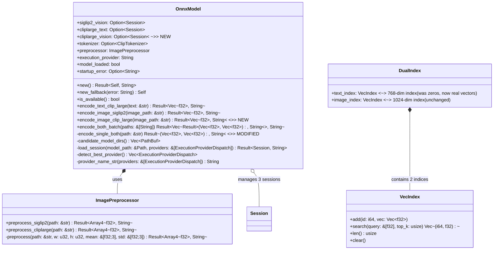
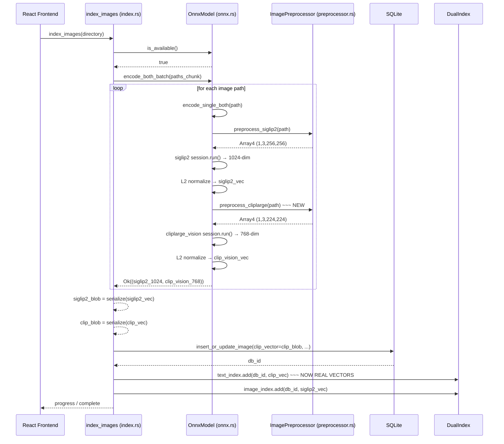
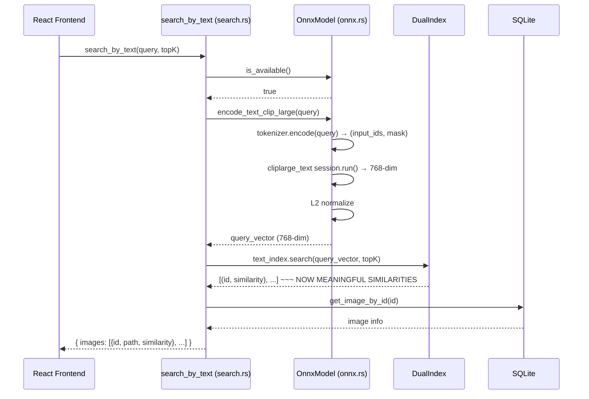
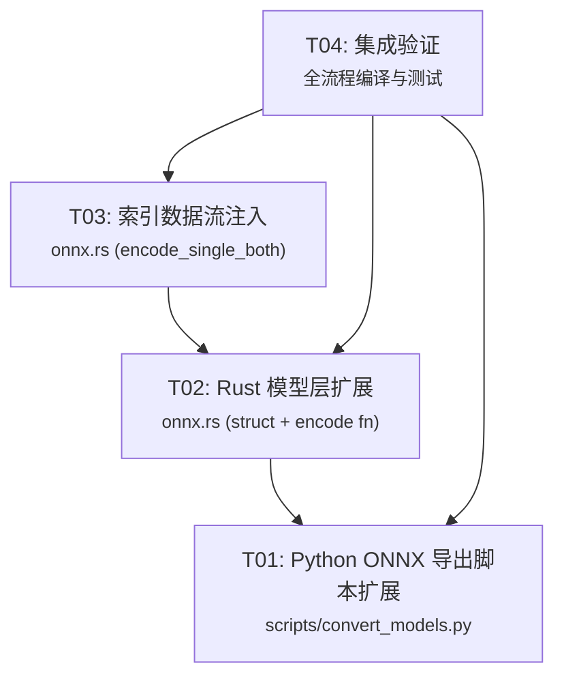

# System Design: Add CLIP-L/14 Vision Encoder

## Part A: System Design

### 1. Implementation Approach

#### Core Technical Challenges

| # | Challenge | Analysis |
|---|-----------|----------|
| 1 | **CLIP visual encoder output dimension** | CLIP-L/14 `vision_model` has `hidden_size=1024`, but the projection layer (`visual_projection`) maps to 768-dim. The text encoder also operates at 768-dim. Both must live in the same 768-dim space to enable text→image search. |
| 2 | **CLIP model access pattern** | `CLIPModel` has `vision_model` + `visual_projection` as separate submodules. Unlike SigLIP2 (which directly outputs 1024-dim pooler), CLIP vision needs an extra projection step. |
| 3 | **Graceful degradation** | CLIP vision encoder is optional — if loading fails, indexing must fall back to `[0.0; 768]` placeholder without blocking the pipeline. |
| 4 | **Search flow unchanged** | `search_by_text()` already correctly searches `text_index` using `encode_text_clip_large()`. The fix is purely on the **indexing side** — `text_index` must contain real CLIP vision vectors instead of zeros. |

#### Design Decisions

| Decision | Choice | Rationale |
|----------|--------|-----------|
| **Wrapper pattern** | `VisionEncoderWrapper` wrapping `vision_model` + `visual_projection` | Matches existing export pattern; outputs correct 768-dim in one ONNX graph |
| **Export source** | `model.get_image_features()` (full model) vs manual wrapping | Use manual wrapper for clarity and to match existing export patterns |
| **Image preprocessing** | Already exists in `preprocessor.rs` as `preprocess_cliplarge()` | 224×224, ImageNet normalize — confirmed by `preprocessor_config.json` |
| **ONNX input/output** | Input: `pixel_values` (1,3,224,224), Output: `image_embeds` (1,768) | Same naming convention as SigLIP2 for consistency |
| **L2 normalization** | Apply in Rust after inference | Same pattern as `encode_image_siglip2()` and `encode_text_clip_large()` |

### 2. File List

| # | File (relative) | Action | Description |
|---|-----------------|--------|-------------|
| 1 | `scripts/convert_models.py` | **MODIFY** | Add `export_cliplarge_vision()` function, update `main()` and output constants |
| 2 | `src-tauri/src/models/onnx.rs` | **MODIFY** | Add `cliplarge_vision` session, `encode_image_clip_large()` method, update `encode_single_both()`, `is_available()`, `new_fallback()` |
| 3 | `src-tauri/src/models/preprocessor.rs` | **NO CHANGE** | `preprocess_cliplarge()` already exists ✅ |
| 4 | `src-tauri/src/models/mod.rs` | **NO CHANGE** | Already re-exports everything needed ✅ |
| 5 | `src-tauri/src/commands/index.rs` | **NO CHANGE** | Already destructures `(siglip2_vec, clip_vec)` from `encode_both_batch()` ✅ |
| 6 | `src-tauri/src/commands/search.rs` | **NO CHANGE** | Search logic unchanged; `text_index` data quality improves ✅ |
| 7 | `src-tauri/tauri.conf.json` | **NO CHANGE** | Already has `"../models/*"` resource glob ✅ |

### 3. Data Structures and Interfaces



#### Key Interface Changes

**New session field** (in `OnnxModel`):
```rust
pub cliplarge_vision: Option<Session>,
```

**New encoding method** (on `OnnxModel`):
```rust
/// Encode image using CLIP-L/14 vision encoder.
///
/// Returns a **L2-normalized** 768-dimensional vector.
pub fn encode_image_clip_large(&mut self, image_path: &str) -> Result<Vec<f32>, String>
```

**Modified encoding method** (on `OnnxModel`):
```rust
/// Old: encode_single_both → (siglip2_1024, [0.0; 768])  // placeholder
/// New: encode_single_both → (siglip2_1024, real_768)     // real CLIP vision vector
fn encode_single_both(&mut self, path: &str) -> Result<(Vec<f32>, Vec<f32>), String>
```

#### ONNX Model Interface (`cliplarge_vision.onnx`)

| Aspect | Value |
|--------|-------|
| Input name | `pixel_values` |
| Input shape | `(batch_size, 3, 224, 224)` — dynamic batch |
| Input dtype | `float32` |
| Output name | `image_embeds` |
| Output shape | `(batch_size, 768)` — dynamic batch |
| Output dtype | `float32` |
| Output semantics | L2-normalized image embedding (normalized in Rust post-processing) |

### 4. Program Call Flow

#### Flow 1: Indexing (with CLIP vision encoder)



#### Flow 2: Semantic Text Search (unchanged, but now works correctly)



### 5. Anything UNCLEAR

| Item | Status |
|------|--------|
| CLIP vision model access path | **Confirmed**: Use `model.vision_model` for the transformer + `model.visual_projection` for the 1024→768 projection. The wrapper will combine both into a single ONNX graph outputting 768-dim `image_embeds`. |
| Image preprocessing params | **Confirmed** by `preprocessor_config.json`: size=224, mean=[0.48145466,0.4578275,0.40821073], std=[0.26862954,0.26130258,0.27577711]. Already implemented in `preprocessor.rs`. |
| ONNX input/output naming | **Decision**: Use `pixel_values` → `image_embeds` (matching SigLIP2 convention for consistency in the Rust code). |
| L2 normalization | **Decision**: Applied in Rust post-inference (same pattern as existing encode functions). |
| Fallback on load failure | **Decision**: If `cliplarge_vision.onnx` fails to load, `encode_single_both()` returns `[0.0; 768]` — indexing continues without CLIP vectors. |

---

## Part B: Task Decomposition

### 6. Required Packages

No new Rust/JS packages needed. Existing dependencies already cover all needs:

| Package | Version | Purpose | Already Present |
|---------|---------|---------|:---:|
| `ort` | 2.0.0-rc.12 | ONNX Runtime (with `directml` feature) | ✅ |
| `ndarray` | 0.16 | Tensor type for preprocessing | ✅ |
| `image` | 0.25 | Image loading and resizing | ✅ |
| `torch` | (Python) | PyTorch for ONNX export | ✅ (dev only) |
| `transformers` | (Python) | HuggingFace model loading | ✅ (dev only) |

**Python export dependencies** (already installed for existing models):
```
pip install torch torchvision transformers accelerate onnx onnxruntime
```

### 7. Task List (ordered by dependency)

| Task ID | Task Name | Source Files | Dependencies | Priority |
|---------|-----------|-------------|--------------|----------|
| **T01** | **项目基础设施 — Python ONNX 导出脚本扩展** | `scripts/convert_models.py` | — | P0 |
| **T02** | **Rust 模型层 — OnnxModel 结构体扩展** | `src-tauri/src/models/onnx.rs` | T01 | P0 |
| **T03** | **索引数据流 — encode_single_both 注入真实 CLIP 向量** | `src-tauri/src/models/onnx.rs` | T02 | P0 |
| **T04** | **集成验证 — 全流程编译与测试** | `scripts/convert_models.py`, `src-tauri/src/models/onnx.rs`, `src-tauri/src/commands/index.rs` | T01, T02, T03 | P1 |

---

#### T01: Python ONNX 导出脚本扩展

- **Source Files**: `scripts/convert_models.py`
- **Dependencies**: None
- **Priority**: P0
- **Description**:

  **变更点**：
  1. 新增输出路径常量 `OUT_CLIPLARGE_VISION`
  2. 新增 `export_cliplarge_vision()` 函数：
     - 从 `CLIPLARGE_SRC` 目录加载 `CLIPModel`
     - 获取 `vision_model` + `visual_projection`
     - 构造包装器：输入 `pixel_values` (1,3,224,224) → `vision_model` → `pooler_output` (1,1024) → `visual_projection` (1,768) → 输出 `image_embeds`
     - dummy 输入: `torch.randn(1, 3, 224, 224)`
     - ONNX 导出参数: opset=17, input_names=["pixel_values"], output_names=["image_embeds"], dynamic_axes 支持 batch
  3. 在 `main()` 中调用 `export_cliplarge_vision()`、更新汇总日志
  4. 在 `verify_onnx()` 中添加 `cliplarge_vision.onnx` 的验证（onnx.checker + ort session 推理测试）

  **输出文件**: `models/cliplarge_vision.onnx`（约 1.7 GB — CLIP-L/14 视觉编码器）

---

#### T02: Rust 模型层 — OnnxModel 结构体扩展

- **Source Files**: `src-tauri/src/models/onnx.rs`
- **Dependencies**: T01 (需要 ONNX 模型文件生成后才可编译测试)
- **Priority**: P0
- **Description**:

  **变更点**：
  1. `OnnxModel` 结构体新增字段：
     ```rust
     pub cliplarge_vision: Option<Session>,
     ```
  2. `OnnxModel::new()` 中新增加载逻辑：
     - 搜索 `cliplarge_vision.onnx` 文件
     - 调用 `Self::load_session()` 加载
     - 成功/失败日志（与现有 siglip2/cliplarge_text 相同风格）
  3. `OnnxModel::new_fallback()` 中新增 `cliplarge_vision: None`
  4. 更新 `model_loaded` 计算：
     ```rust
     let model_loaded = siglip2_vision.is_some() 
         || cliplarge_text.is_some() 
         || cliplarge_vision.is_some();  // NEW
     ```
  5. 新增 `encode_image_clip_large()` 方法：
     ```rust
     pub fn encode_image_clip_large(&mut self, image_path: &str) -> Result<Vec<f32>, String> {
         // 1. Preprocess → (1, 3, 224, 224) f32
         let pixel_values = ImagePreprocessor::preprocess_cliplarge(image_path)?;
         
         // 2. Create ONNX input tensor
         let pixel_slice = pixel_values.as_slice()
             .ok_or_else(|| "Pixel values not contiguous".to_string())?;
         let input_tensor = TensorRef::from_array_view(([1usize, 3, 224, 224], pixel_slice))
             .map_err(|e| format!("Failed to create input tensor: {}", e))?;
         
         // 3. Run inference
         let outputs = session.run(ort::inputs!["pixel_values" => input_tensor])
             .map_err(|e| format!("ONNX inference error: {}", e))?;
         
         // 4. Extract output (image_embeds: (1, 768) f32)
         let output_array = outputs["image_embeds"]
             .try_extract_array::<f32>()
             .map_err(|e| format!("Failed to extract output tensor: {}", e))?;
         
         let mut embedding: Vec<f32> = output_array.iter().copied().collect();
         
         // 5. L2 normalize
         l2_normalize_in_place(&mut embedding);
         
         Ok(embedding)
     }
     ```

---

#### T03: 索引数据流 — encode_single_both 注入真实 CLIP 向量

- **Source Files**: `src-tauri/src/models/onnx.rs`
- **Dependencies**: T02
- **Priority**: P0
- **Description**:

  **变更点**（仅 `encode_single_both()` 方法）：
  ```rust
  fn encode_single_both(&mut self, path: &str) -> Result<(Vec<f32>, Vec<f32>), String> {
      let siglip2_vec = if self.siglip2_vision.is_some() {
          self.encode_image_siglip2(path)?
      } else {
          return Err("SigLIP2 vision model not loaded".to_string());
      };

      // ~~~ NEW: Use real CLIP vision vector instead of [0.0; 768] placeholder
      let clip_vec = if self.cliplarge_vision.is_some() {
          self.encode_image_clip_large(path)
              .unwrap_or_else(|e| {
                  eprintln!("[ONNX] CLIP vision encoding failed (fallback to zero): {}", e);
                  vec![0.0_f32; 768]
              })
      } else {
          eprintln!("[ONNX] CLIP vision model not loaded, using zero vector");
          vec![0.0_f32; 768]
      };

      Ok((siglip2_vec, clip_vec))
  }
  ```

  **关键语义**：如果 CLIP 视觉模型加载失败或不加载，索引不阻塞——回退到 `[0.0; 768]`。此回退行为与旧版本一致，不影响 SigLIP2 以图搜图。

---

#### T04: 集成验证 — 全流程编译与测试

- **Source Files**: `scripts/convert_models.py`, `src-tauri/src/models/onnx.rs`, `src-tauri/src/commands/index.rs`, `src-tauri/src/commands/search.rs`
- **Dependencies**: T01, T02, T03
- **Priority**: P1
- **Description**:

  **验证步骤**：
  1. **运行 ONNX 导出**：
     ```bash
     cd D:\local-image-search3
     python scripts/convert_models.py
     ```
     - 确认输出存在: `models/cliplarge_vision.onnx`（约 1.7 GB）
     - 确认验证通过（verify_onnx 无报错）

  2. **Rust 编译**：
     ```bash
     cd D:\local-image-search3\src-tauri
     cargo check
     cargo build
     ```
     - 确认无编译错误
     - 确认 new_clippy 无警告

  3. **运行时验证**：
     - 启动应用，确认 "CLIP-L/14 vision model loaded" 日志出现
     - 索引一批图片
     - 通过语义搜索验证：对已知内容图片进行搜索，确认返回相关结果（不再返回无意义结果）

  4. **退化测试**：
     - 删除 `cliplarge_vision.onnx`，重启应用
     - 确认索引仍然正常工作（CLIP 向量存为 `[0.0; 768]`）
     - 确认 SigLIP2 以图搜图仍然正常

### 8. Shared Knowledge

| Concern | Convention |
|---------|-----------|
| **ONNX session naming** | Session field name = model filename without extension: `siglip2_vision`, `cliplarge_text`, `cliplarge_vision` |
| **ONNX I/O naming** | Input: `pixel_values`, Output: `image_embeds` (consistent across both vision models) |
| **Vector normalization** | All embeddings are L2-normalized in Rust post-inference using `l2_normalize_in_place()` |
| **Fallback convention** | CLIP vision failure → `vec![0.0_f32; 768]` (non-blocking). SigLIP2 failure → error (blocking). |
| **Image preprocessing** | SigLIP2: 256×256, mean/std=0.5. CLIP: 224×224, ImageNet mean/std. Already separated in `ImagePreprocessor`. |
| **Export device** | Python export auto-detects CUDA; ONNX model runs on CPU or GPU via ort's provider detection. |

### 9. Task Dependency Graph



**依赖关系说明**：
- **T01**（Python 导出）是**独立任务**，无任何依赖，可最先执行
- **T02**（Rust 结构体扩展）依赖 T01 生成的 ONNX 模型文件，但 Rust 代码可**逻辑上先编写**（字段声明、函数签名），模型文件只用于编译时路径检查或运行时加载测试
- **T03**（索引数据流修改）依赖 T02 提供 `encode_image_clip_large()` 方法
- **T04**（集成验证）是最终验证任务，依赖所有前置任务完成
